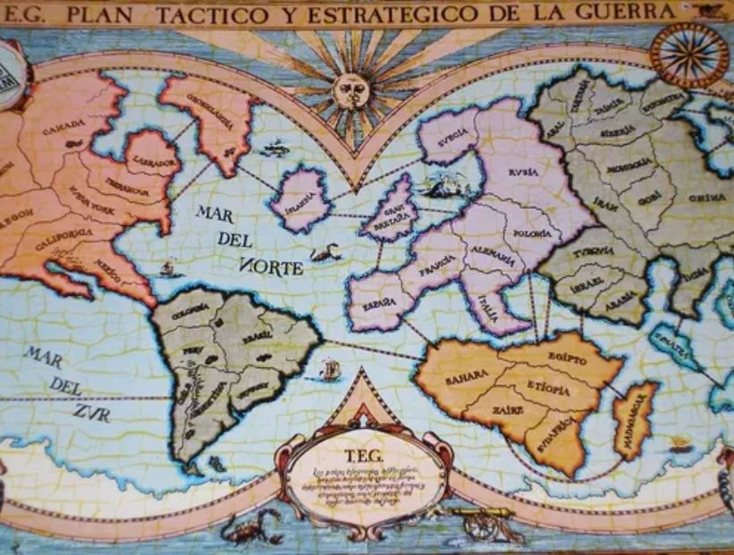

<p align="center">
  
</p>

# TEG

El TEG (Táctica y Estrategia de la Guerra) es un clásico juego de mesa de estrategia que desafía a los jugadores a 
conquistar el mundo mediante la planificación, la negociación y la toma de decisiones tácticas. Inspirado en juegos 
de guerra y geopolítica, el TEG combina azar y estrategia, obligando a los jugadores a gestionar recursos, evaluar 
riesgos y anticipar movimientos enemigos para lograr sus objetivos de dominación global. El juego propone un 
conflicto bélico que tiene lugar sobre un mapa-tablero dividido en 50 países.

En este contexto, como parte de la materia Programación III, se presenta el desafío de desarrollar una versión 
digital del TEG, implementando tanto el front-end como el back-end del juego. Este proyecto no solo pondrá a 
prueba los conocimientos adquiridos en programación, sino que también requerirá una comprensión profunda de las 
reglas y mecánicas del juego, además de habilidades en diseño de interfaces, manejo de datos y lógica de negocio.

Los estudiantes deberán aplicar conceptos clave de desarrollo de software, tales como arquitectura cliente-servidor, 
comunicación a través de APIs, gestión del estado del juego y sincronización de eventos en una aplicación 
interactiva y funcional.

Este desafío ofrece una oportunidad única para integrar conocimientos teóricos con su aplicación práctica en un 
proyecto realista, fomentando la creatividad y el trabajo en equipo.

## 📜 Reglamento TEG a usar

[REGLAMENTO](./docs/TEG.pdf)

# TPI

Este proyecto es parte del Trabajo Práctico Integrador (TPI) realizado durante el año 2025,
de la asignatura Programación III de la carrera "Tecnicatura Universitaria en Programación"
de la "Universidad Tecnológica Nacional - Facultad Regional Córdoba".

---

## 📁 Estructura del Proyecto (Frontend Angular)

A continuación se detalla la estructura de carpetas utilizada en el proyecto Angular, pensada para mantener el código organizado, limpio y fácil de escalar.

```

📁 src
├── 📁 app
│   ├── 📁 core
│   │   ├── 📁 services         # Servicios reutilizables (ej: manejo de API, autenticación)
│   │   └── 📁 models           # Interfaces y modelos del dominio del juego (Jugador, País, Objetivo, etc.)
│
│   ├── 📁 shared
│   │   ├── 📁 components       # Componentes reutilizables (botones, tarjetas, encabezados)
│   │   ├── 📁 pipes            # Pipes personalizados (formatear texto, filtros)
│   │   ├── 📁 directives       # Directivas personalizadas (resaltar elementos, validaciones)
│
│   ├── 📁 features
│   │   ├── 📁 login            # Componentes y lógica de la pantalla de login
│   │   ├── 📁 mapa             # Mapa del juego con los países y acciones del tablero
│   │   ├── 📁 dashboard        # Vista principal del juego con menú, estado, acciones
│   │   └── 📁 reglas           # Pantalla que muestra las reglas del juego
│
│   ├── 📁 routes
│   │   └── app.routes.ts      # Definición de las rutas principales del sistema
│
│   ├── 📁 layouts
│   │   └── main-layout.component.ts  # Componente contenedor con encabezado/nav y <router-outlet>
│
│   ├── app.component.ts       # Componente raíz de la aplicación
│   └── app.config.ts          # Configuración principal del proyecto (routing, providers, etc.)
│
├── 📁 assets
│   ├── 📁 images               # Imágenes utilizadas por la aplicación (iconos, mapa, etc.)
│
├── 📁 environments
│   ├── environment.ts         # Configuración para entorno de desarrollo
│   └── environment.prod.ts    # Configuración para entorno de producción
│
└── main.ts                    # Punto de entrada de la aplicación Angular

```

---

## 🧠 Recomendaciones para estudiantes

- Agrupar los componentes por **pantalla o funcionalidad** dentro de `features`.
- Reutilizar elementos comunes como botones o tarjetas dentro de `shared/components`.
- Crear una interfaz para cada entidad del juego (ej: `Jugador`, `Partida`, `País`) dentro de `core/models`.
- Colocar los documentos del proyecto (como el reglamento o guías técnicas) dentro de `/docs`.


